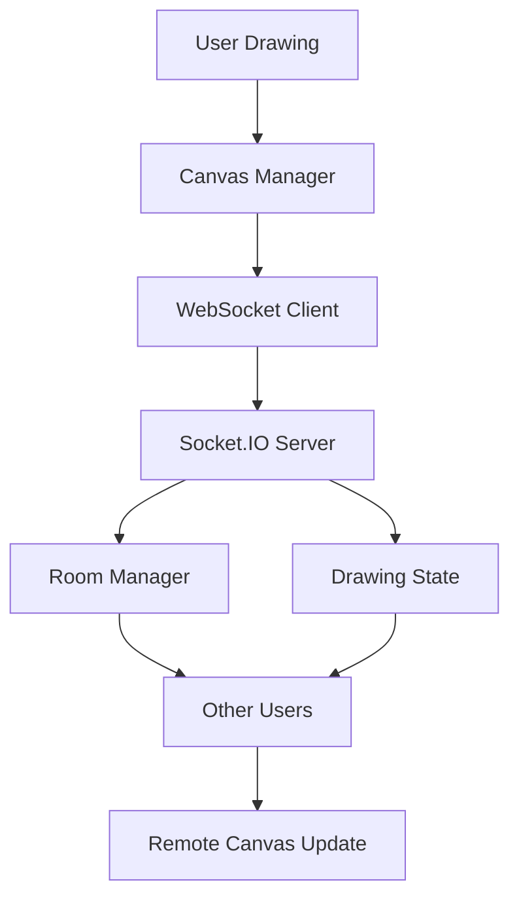

# Architecture Documentation

## Data Flow Diagram

## WebSocket Protocol

### Client to Server Messages

1. **join-room**
   - Purpose: Join a drawing room
   - Data: `{ roomId: string }`

2. **leave-room**
   - Purpose: Leave a drawing room
   - Data: `{ roomId: string }`

3. **draw-path**
   - Purpose: Send drawing data to other users
   - Data: `{ id: string, userId: string, points: Array, timestamp: number }`

4. **undo-path**
   - Purpose: Request undo of a path
   - Data: `{ pathId: string }`

5. **redo-path**
   - Purpose: Request redo of a path
   - Data: `{ pathId: string }`

6. **clear-canvas**
   - Purpose: Clear the entire canvas
   - Data: None

7. **cursor-move**
   - Purpose: Update cursor position
   - Data: `{ x: number, y: number, color: string, userId: string }`

### Server to Client Messages

1. **user-joined**
   - Purpose: Notify about new user
   - Data: `{ userId: string, color: string, name: string }`

2. **user-left**
   - Purpose: Notify about user departure
   - Data: `{ userId: string }`

3. **draw-path**
   - Purpose: Receive drawing data from other users
   - Data: `{ id: string, userId: string, points: Array, timestamp: number }`

4. **path-undone**
   - Purpose: Notify about undone path
   - Data: `{ pathId: string }`

5. **path-redone**
   - Purpose: Notify about redone path
   - Data: `{ id: string, userId: string, points: Array, timestamp: number }`

6. **canvas-cleared**
   - Purpose: Notify about cleared canvas
   - Data: None

7. **cursor-move**
   - Purpose: Receive cursor position updates
   - Data: `{ x: number, y: number, color: string, userId: string }`

8. **initial-state**
   - Purpose: Send initial canvas state to new users
   - Data: `{ paths: Array, users: Object }`

## Undo/Redo Strategy

### Implementation Approach

1. **Local Storage**: Each client maintains three arrays:
   - `paths`: All paths currently on the canvas
   - `undoStack`: Paths that can be undone
   - `redoStack`: Paths that can be redone

2. **Global Synchronization**: When a user performs undo/redo:
   - The action is sent to the server
   - Server broadcasts to all other clients
   - Other clients update their local state accordingly

3. **Path Identification**: Each path has a unique ID generated by the client, ensuring consistent identification across all clients.

### Limitations

- Redo functionality is simplified and may not work perfectly in all scenarios
- Conflicts can occur when multiple users perform undo/redo simultaneously

## Performance Decisions

### Canvas Optimization

1. **Path-based Drawing**: Instead of redrawing the entire canvas, we store and redraw individual paths
2. **Event Throttling**: Mouse events are processed efficiently to ensure smooth drawing
3. **Memory Management**: Old paths are periodically removed to prevent memory leaks

### Network Optimization

1. **Path Serialization**: Only essential path data is transmitted (points, color, stroke width)
2. **Batching**: Related events are batched when possible to reduce network overhead
3. **Delta Updates**: Only changes are sent, not entire canvas states

### Client-side Prediction

1. **Immediate Feedback**: Drawing appears immediately on the local canvas
2. **Correction Handling**: If server corrections are needed, they are applied seamlessly

## Conflict Resolution

### Simultaneous Drawing

1. **Last Write Wins**: When multiple users draw in the same area, the last received path is displayed on top
2. **Path Independence**: Each path is treated as an independent entity, preventing partial overwrites

### Undo/Redo Conflicts

1. **User-specific Actions**: Undo/Redo only affects paths created by the same user
2. **Global Notifications**: All users are notified of undo/redo actions to maintain consistency

## Scalability Considerations

### Current Limitations

1. **In-memory Storage**: All drawing state is stored in server memory
2. **Single Room**: Currently only supports one drawing room
3. **No Load Balancing**: Application runs on a single server instance

### Potential Improvements

1. **Database Storage**: Persist drawing state to a database
2. **Room System**: Implement multiple isolated drawing rooms
3. **Clustering**: Use Node.js clustering for better performance
4. **CDN**: Serve static assets through a CDN for better performance